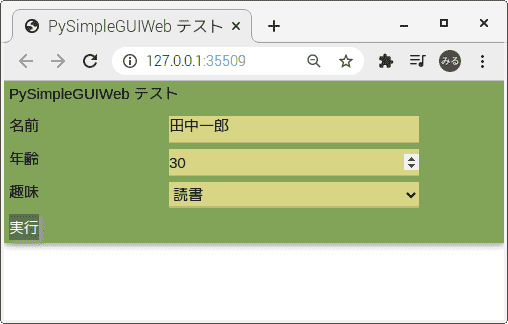
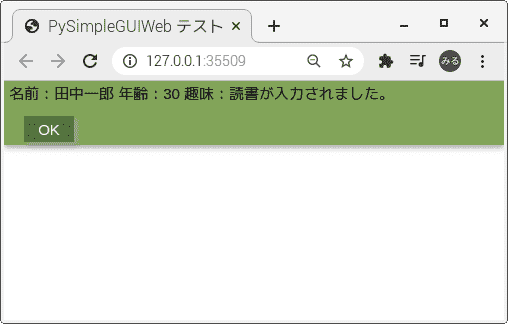

[ja](./README.ja.md)

# PySimpleGuiWeb.SetUp

Build the environment of PySimpleGuiWeb.

# DEMO




# Requirement

* <time datetime="2021-06-18T11:00:23+0900">2021-06-18</time>
* [Raspbierry Pi](https://ja.wikipedia.org/wiki/Raspberry_Pi) 4 Model B Rev 1.2
* [Raspberry Pi OS](https://ja.wikipedia.org/wiki/Raspbian) buster 10.0 2020-08-20 <small>[setup](http://ytyaru.hatenablog.com/entry/2020/10/06/111111)</small>
* bash 5.0.3(1)-release
* Python 2.7.16
* Python 3.7.3

```sh
$ uname -a
Linux raspberrypi 5.4.83-v7l+ #1379 SMP Mon Dec 14 13:11:54 GMT 2020 armv7l GNU/Linux
```

# Installation

```sh
git clone https://github.com/ytyaru/Python.PySimpleGuiWeb.SetUp.20210618110027
cd Python.PySimpleGuiWeb.SetUp.20210618110027/src
./setup.sh
```

# Usage

```sh
git clone https://github.com/ytyaru/Python.PySimpleGuiWeb.SetUp.20210618110027
cd Python.PySimpleGuiWeb.SetUp.20210618110027/src
./run.sh
```

# Author

ytyaru

* [](https://github.com/ytyaru "github")
* [](http://ytyaru.hatenablog.com/ytyaru "hatena")
* [](https://mstdn.jp/web/accounts/233143 "mastdon")

# License

This software is CC0 licensed.

[](http://creativecommons.org/publicdomain/zero/1.0/deed.en)

